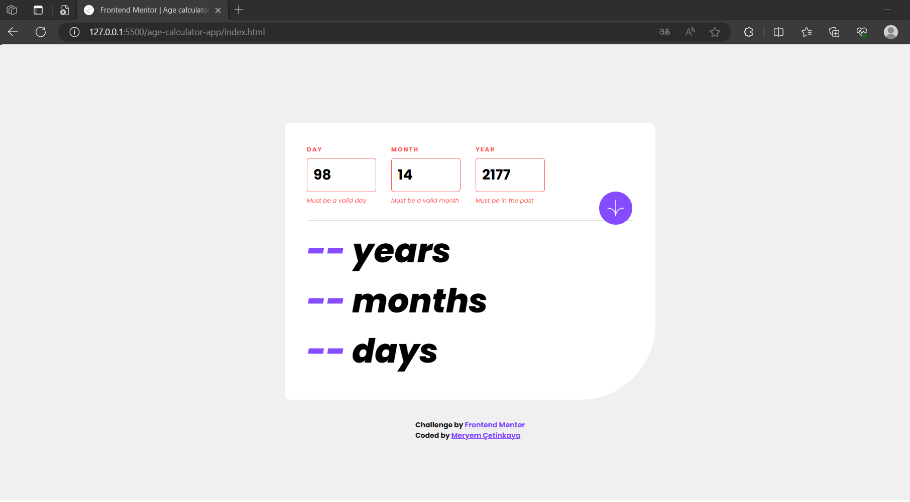
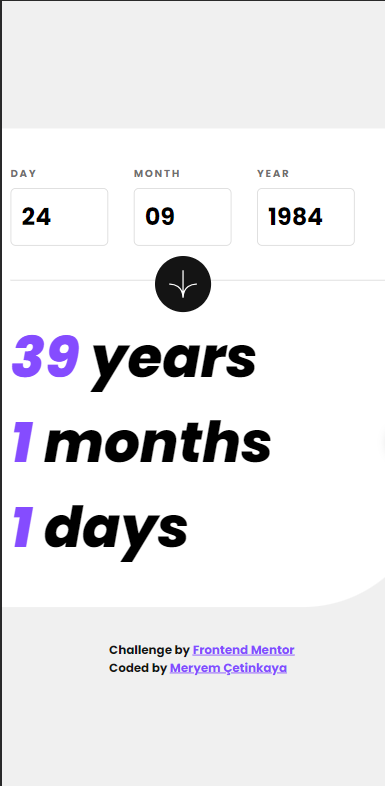

# Frontend Mentor - Age calculator app solution

This is a solution to the [Age calculator app challenge on Frontend Mentor](https://www.frontendmentor.io/challenges/age-calculator-app-dF9DFFpj-Q).

## Overview

### The challenge

Users should be able to:

- View an age in years, months, and days after submitting a valid date through the form
- Receive validation errors if:
  - Any field is empty when the form is submitted
  - The day number is not between 1-31
  - The month number is not between 1-12
  - The year is in the future
  - The date is invalid e.g. 31/04/1991 (there are 30 days in April)
- View the optimal layout for the interface depending on their device's screen size
- See hover and focus states for all interactive elements on the page

### Screenshot

  
  

### Links

- Live Site URL: [https://age-calculator-app-0.netlify.app/](https://age-calculator-app-0.netlify.app/)

## My process

### Built with

- Semantic HTML5 markup
- CSS custom properties
- Flexbox
- CSS Grid
- Mobile-first workflow
- JavaScript

### What I learned

In this project, I learned and applied several valuable concepts, particularly in JavaScript. Here's what I gained from this project:

1. **Form Handling**: I acquired a strong understanding of form handling in JavaScript, including event listening and form submission prevention. I used **`addEventListener`** to capture the form submission event and prevent it from triggering the default behavior.
2. **Input Validation**: I implemented comprehensive input validation for day, month, and year fields to ensure user input is accurate and within expected ranges. This involved handling various scenarios such as missing values, invalid days, months, and years, and checking if the year is in the past.
3. **Error Handling**: I learned how to display meaningful error messages to users by dynamically manipulating the DOM. Error messages were shown when input validation failed, and I applied CSS classes to style error-prone fields.
4. **Date Manipulation**: I practiced working with date objects to calculate age based on the provided birthdate and the current date. I also handled cases where the birthdate is in the future or when months or days need adjustments.
5. **Responsive Design**: I ensured the project's layout and design are responsive by incorporating CSS media queries, providing an optimal user experience on various devices.
6. **DOM Manipulation**: I gained extensive experience with DOM manipulation to select and update HTML elements based on user input and calculations. This included changing text content, displaying and hiding error messages, and modifying styles dynamically.
7. **CSS Custom Properties (Variables)**: I used CSS custom properties (variables) to define and maintain color values in a consistent manner throughout the project, improving maintainability and design consistency.
8. **Git and Version Control**: While not explicitly mentioned in the code, I developed good practices in version control using Git. I managed and tracked changes to the project files, which is essential for collaborative and iterative development.
9. **Collaboration and Documentation**: The project allowed me to simulate real-world development practices by utilizing code comments and creating clear documentation. This experience is important for effective collaboration with other developers and team members.

Overall, this project significantly improved my skills in JavaScript, form handling, input validation, and error management.

## Author

💼 **LinkedIn**: <a title="Meryem Çetinkaya | LinkedIn" href="https://www.linkedin.com/in/meryem-cetinkaya/" target="_blank">Meryem Çetinkaya</a> 
🐈‍⬛ **GitHub**: <a title="Meryem Çetinkaya | GitHub" href="https://github.com/meryemctnky" target="_blank">Meryem Çetinkaya</a> 
📩 **E-mail**: <a title="meryemctnkya@gmail.com" href="mailto:meryemctnkya@gmail.com" target="_blank">meryemctnkya@gmail.com</a>  
