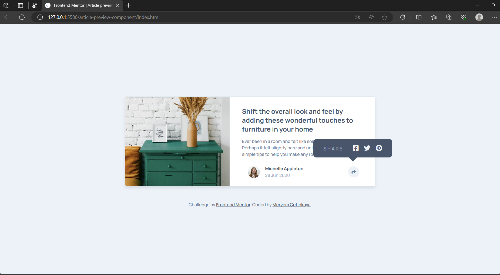
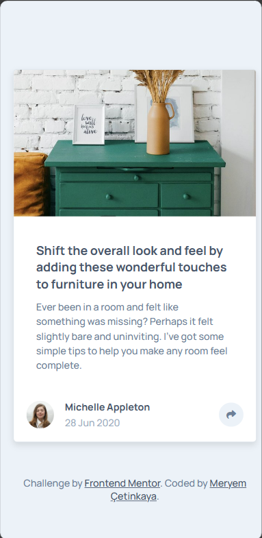
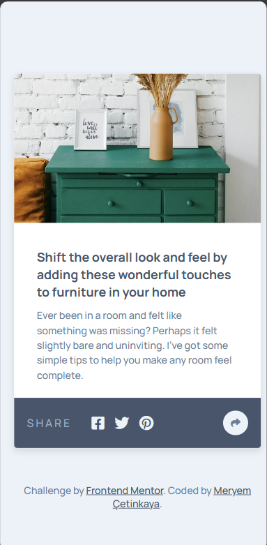

# Frontend Mentor - Article preview component solution

This is a solution to the [Article preview component challenge on Frontend Mentor](https://www.frontendmentor.io/challenges/article-preview-component-dYBN_pYFT).

## Overview

### The challenge

Users should be able to:

- View the optimal layout for the component depending on their device's screen size
- See the social media share links when they click the share icon

### Screenshot

  
  
  

### Links

- Live Site URL: [https://article-preview-component-0.netlify.app/](https://article-preview-component-0.netlify.app/)

## My process

### Built with

- Semantic HTML5 markup
- CSS custom properties
- Flexbox
- CSS Grid
- Mobile-first workflow
- JavaScript

### What I learned

In this project, I learned the following:

1. **HTML Structure**: I learned how to structure an HTML document, including adding metadata, linking to external resources, and creating a main content section.
2. **CSS Styling**: I gained experience in applying CSS styles to create an attractive and responsive user interface. You used variables for color management, handled fonts and text formatting, and applied CSS classes to structure the layout of the article preview component.
3. **Responsive Design**: I learned about responsive web design by using media queries to adapt the component's layout and styling based on the screen size. This ensures your component looks good on both mobile and desktop devices.
4. **Flexbox Layout**: I utilized flexbox for creating the layout of the article preview component. This helped in arranging content elements in a flexible and visually appealing manner.
5. **JavaScript**:
   I learned
   1. Applied an event listener to the 'share' element for handling user clicks.
   2. Modified the display behavior of the 'author' and 'tooltip' elements based on the screen size.
   3. Implemented conditional logic to manage the appearance and disappearance of the tooltip and author details based on screen width.
   4. Dynamically changed the background color of the 'share' element on certain user interactions.
6. **External Resources**: I included external resources like the Font Awesome icon library and Google Fonts for enhanced functionality and typography choices.

Overall, this project allowed me to strengthen my skills in HTML, CSS, and JavaScript, as well as gain practical experience in building interactive user interfaces and managing user interactions effectively.

## Author

💼 **LinkedIn**: <a title="Meryem Çetinkaya | LinkedIn" href="https://www.linkedin.com/in/meryem-cetinkaya/" target="_blank">Meryem Çetinkaya</a> 
🐈‍⬛ **GitHub**: <a title="Meryem Çetinkaya | GitHub" href="https://github.com/meryemctnky" target="_blank">Meryem Çetinkaya</a> 
📩 **E-mail**: <a title="meryemctnkya@gmail.com" href="mailto:meryemctnkya@gmail.com" target="_blank">meryemctnkya@gmail.com</a>  
