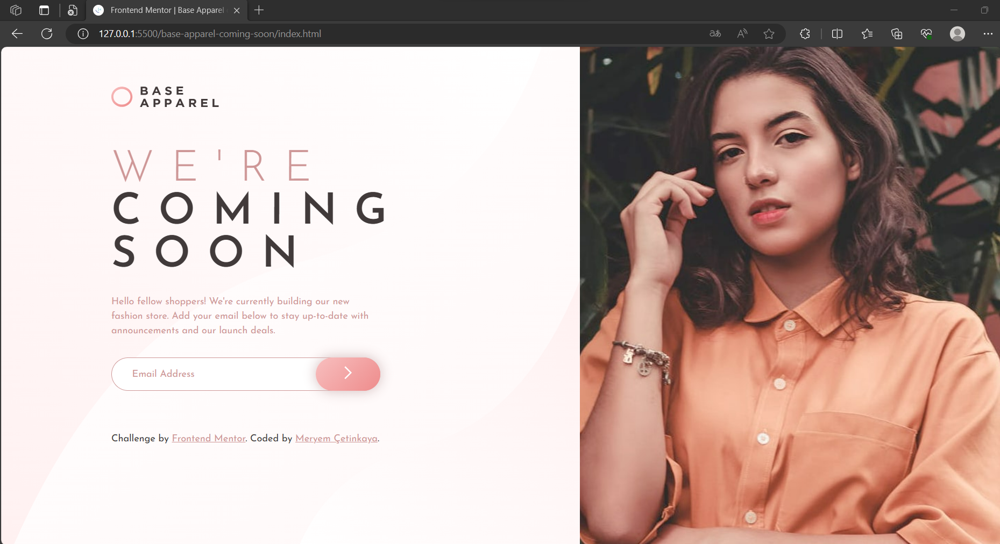

# Frontend Mentor - Base Apparel coming soon page solution

This is a solution to the [Base Apparel coming soon page challenge on Frontend Mentor](https://www.frontendmentor.io/challenges/base-apparel-coming-soon-page-5d46b47f8db8a7063f9331a0).

## Overview

### The challenge

Users should be able to:

- View the optimal layout for the site depending on their device's screen size
- See hover states for all interactive elements on the page
- Receive an error message when the `form` is submitted if:
  - The `input` field is empty
  - The email address is not formatted correctly

### Screenshot

  
  

### Links

- Live Site URL: [https://base-apparel-coming-soon-page-0.netlify.app/](https://base-apparel-coming-soon-page-0.netlify.app/)

## My process

### Built with

- Semantic HTML5 markup
- CSS custom properties
- Flexbox
- CSS Grid
- Mobile-first workflow
- JavaScript

### What I learned

In this project, I learned the following:

1. **HTML Structure**: I practiced creating a structured HTML document with proper semantics, including elements such as headers, main content, forms, images, and links.
2. **CSS Styling**: I gained experience in using CSS to style the webpage, including defining custom properties (CSS variables) and applying styles to elements, such as fonts, colors, backgrounds, borders, and box shadows.
3. **Responsive Design**: I learned to make the webpage responsive by applying media queries for different screen sizes. This ensures that the content displays well on both mobile and desktop devices.
4. **DOM Manipulation**: I used JavaScript to handle user interactions, such as form validation. When the user submits an email address, JavaScript checks if the email is valid and provides appropriate feedback based on the input.
5. **Form Validation**: I implemented basic form validation by checking if the user's email input is in a valid format using a regular expression. If the email is valid, a success message is displayed; otherwise, an error message is shown.
6. **Event Handling**: I practiced adding event listeners to elements and responding to user actions, like clicking a submit button.

Overall, this project provided valuable experience in creating a complete web page, styling it effectively, and adding interactivity through JavaScript.

## Author

💼 **LinkedIn**: <a title="Meryem Çetinkaya | LinkedIn" href="https://www.linkedin.com/in/meryem-cetinkaya/" target="_blank">Meryem Çetinkaya</a> 
🐈‍⬛ **GitHub**: <a title="Meryem Çetinkaya | GitHub" href="https://github.com/meryemctnky" target="_blank">Meryem Çetinkaya</a> 
📩 **E-mail**: <a title="meryemctnkya@gmail.com" href="mailto:meryemctnkya@gmail.com" target="_blank">meryemctnkya@gmail.com</a>  
