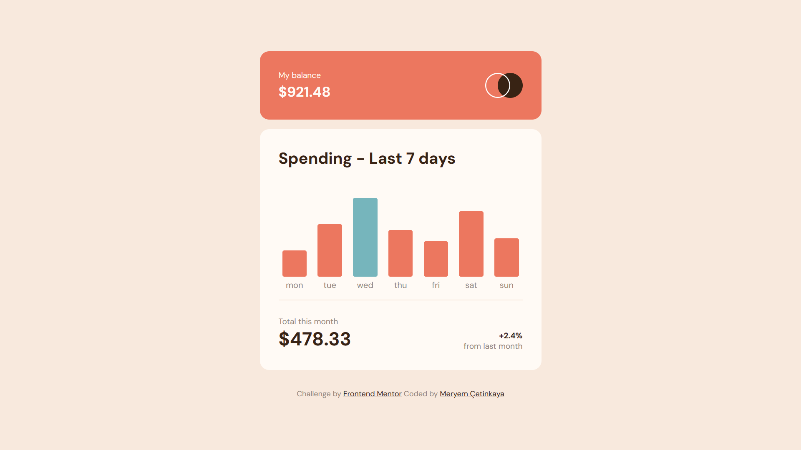
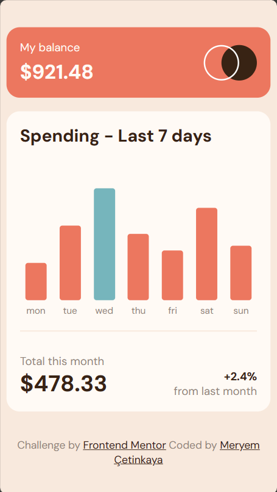

# Frontend Mentor - Expenses chart component solution

This is a solution to the [Expenses chart component challenge on Frontend Mentor](https://www.frontendmentor.io/challenges/expenses-chart-component-e7yJBUdjwt).

## Overview

### The challenge

Users should be able to:

- View the bar chart and hover over the individual bars to see the correct amounts for each day
- See the current day’s bar highlighted in a different colour to the other bars
- View the optimal layout for the content depending on their device’s screen size
- See hover states for all interactive elements on the page
- **Bonus**: Use the JSON data file provided to dynamically size the bars on the chart

### Screenshot

  
  

### Links

- Live Site URL: [https://expenses-chart-component-0.netlify.app/](https://expenses-chart-component-0.netlify.app/)

## My process

### Built with

- Semantic HTML5 markup
- CSS custom properties
- Flexbox
- Mobile-first workflow
- JavaScript

### What I learned

In this project, I learned and applied various concepts related to creating an interactive bar chart component, adhering to the specified requirements:

1. **Bar Chart Visualization**:
   - I gained knowledge about rendering a bar chart using dynamic data provided in a JSON file. This involved dynamically sizing the bars based on the data, with the bar heights proportional to the corresponding amounts.
2. **Interactive Features**:
   - I implemented interactive features such as hover states for the bars, which display the precise amounts for each day when hovered over. The current day's bar is highlighted in a different color from the other bars, enhancing its visibility.
3. **Responsive Design**:
   - I developed a responsive layout for the content, ensuring optimal display on various screen sizes. This involved using media queries and appropriate styling to accommodate different screen dimensions.
4. **CSS Styling**:
   - I utilized CSS to style the components of the chart, including the bars, labels, and tooltips. I also applied different colors and transitions to enhance the visual appeal and user experience.
5. **Asynchronous Data Fetching**:
   - I gained experience in fetching data from a JSON file asynchronously, allowing the chart to populate dynamically based on the retrieved data.
6. **Error Handling**:
   - I incorporated error handling to manage potential issues that may arise during the data-fetching process. I ensured that any errors encountered were logged to the console for debugging purposes.
7. **Event Handling**:
   - I utilized event listeners to create interactive elements, enabling the display of tooltips upon hovering over the bars. I also implemented the removal of tooltips when the cursor is moved away from the bars.
8. **Working with JSON Data**:
   - I successfully processed and utilized data from a JSON file to populate the bar chart dynamically, gaining insights into the manipulation and usage of JSON data in web development.

Overall, this project provided valuable hands-on experience in building an interactive and responsive bar chart component, incorporating dynamic data rendering, hover states, and visually appealing design. It also reinforced key concepts in web development, such as working with JSON data, event handling, and asynchronous data fetching.

## Author

💼 **LinkedIn**: <a title="Meryem Çetinkaya | LinkedIn" href="https://www.linkedin.com/in/meryem-cetinkaya/" target="_blank">Meryem Çetinkaya</a> 
🐈‍⬛ **GitHub**: <a title="Meryem Çetinkaya | GitHub" href="https://github.com/meryemctnky" target="_blank">Meryem Çetinkaya</a> 
📩 **E-mail**: <a title="meryemctnkya@gmail.com" href="mailto:meryemctnkya@gmail.com" target="_blank">meryemctnkya@gmail.com</a>  
