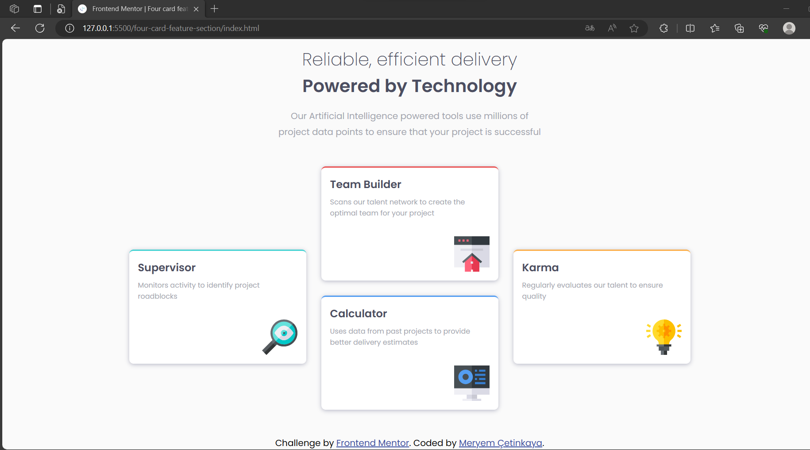

# Frontend Mentor - Four card feature section solution

This is a solution to the [Four card feature section challenge on Frontend Mentor](https://www.frontendmentor.io/challenges/four-card-feature-section-weK1eFYK).

## Overview

### The challenge

Users should be able to:

- View the optimal layout for the interface depending on their device's screen size

### Screenshot

  
  

### Links

- Live Site URL: [https://four-card-feature-section-1.netlify.app/](https://four-card-feature-section-1.netlify.app/)

## My process

### Built with

- Semantic HTML5 markup
- CSS custom properties
- Flexbox
- CSS Grid
- Mobile-first workflow

### What I learned

1. **HTML Structure**: I gained experience in structuring an HTML document, including setting up the document type, character encoding, and viewport settings for responsive design.
2. **CSS Styling**: I learned how to apply CSS styles to create an attractive and visually appealing four-card feature section. This included defining custom CSS variables for color management and utilizing CSS flex properties for layout control.
3. **Responsive Design**: I practiced creating a responsive layout that adapts to different screen sizes. I used media queries to adjust the design and layout for screens with a minimum width of 768px.
4. **Typography**: I applied custom fonts from Google Fonts and adjusted font weights to achieve the desired typography style for the project.
5. **Box Model**: I utilized the CSS box model for proper spacing and sizing of elements, ensuring that they display correctly on the page.
6. **Flexbox**: I used Flexbox to arrange and position elements within the header and main sections, allowing for consistent alignment and spacing.
7. **CSS Variables**: I employed CSS variables to manage and maintain consistent color values throughout the project.
8. **Background Images**: I added background images to the body element, creating a visually appealing background pattern.
9. **Border and Box Shadow**: I used CSS to apply borders and box shadows to the cards, enhancing their appearance and creating depth.
10. **Float and Clear**: I used the **`float`** property to position images within the card sections and applied the **`clear`** property to prevent layout issues caused by floating elements.
11. **Ordering**: I applied the **`order`** property to reorder elements within the flex container, allowing for a specific visual arrangement of cards.
12. **Overlapping Elements**: I used the **`position`** property to create a slight overlap effect on some of the cards when the screen width exceeds a certain breakpoint.
13. **Linking**: I included links in the footer section to provide attribution and credit to Frontend Mentor and the project's creator.

Overall, this project provided valuable hands-on experience in HTML structure, CSS styling, responsive design, typography, and layout control, enabling me to create an appealing and functional four-card feature section for a web page.

## Author

💼 **LinkedIn**: <a title="Meryem Çetinkaya | LinkedIn" href="https://www.linkedin.com/in/meryem-cetinkaya/" target="_blank">Meryem Çetinkaya</a> 
🐈‍⬛ **GitHub**: <a title="Meryem Çetinkaya | GitHub" href="https://github.com/meryemctnky" target="_blank">Meryem Çetinkaya</a> 
📩 **E-mail**: <a title="meryemctnkya@gmail.com" href="mailto:meryemctnkya@gmail.com" target="_blank">meryemctnkya@gmail.com</a>  
