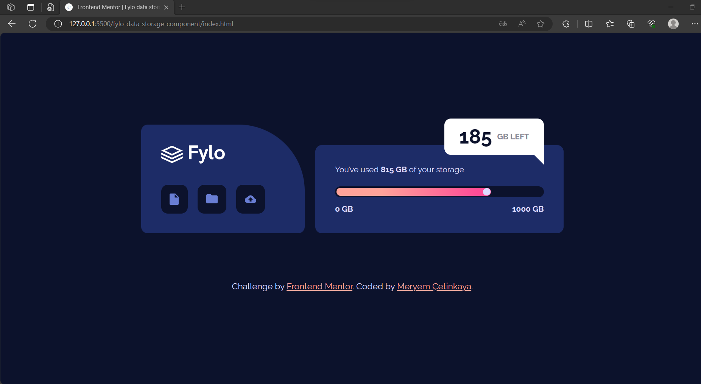
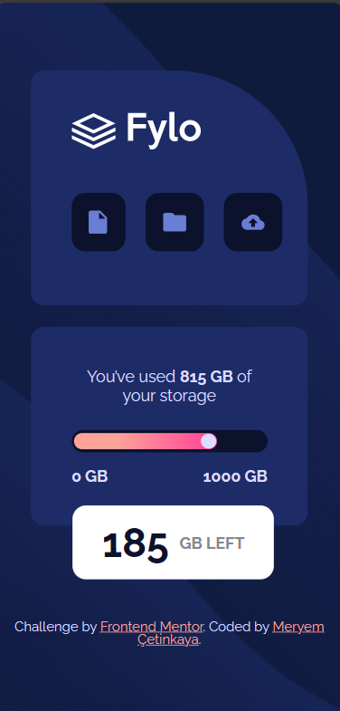

# Frontend Mentor - Fylo data storage component solution

This is a solution to the [Fylo data storage component challenge on Frontend Mentor](https://www.frontendmentor.io/challenges/fylo-data-storage-component-1dZPRbV5n).

## Overview

### The challenge

Users should be able to:

- View the optimal layout for the interface depending on their device's screen size

### Screenshot

  
  

### Links

- Live Site URL: [https://fylo-data-storage-component-1.netlify.app/](https://fylo-data-storage-component-1.netlify.app/)

## My process

### Built with

- Semantic HTML5 markup
- CSS Grid
- CSS custom properties
- Flexbox
- Mobile-first workflow

### What I learned

In this project, I learned the following:

1. **Create Responsive Layouts**: I gained experience in designing responsive web layouts that adapt well to different screen sizes and devices. I used CSS properties like **`width`**, **`max-width`**, and **`flexbox`** to ensure the content remains visually appealing and functional on both mobile and desktop screens.
2. **Apply Background Images**: I learned how to use background images to enhance the visual aesthetics of web pages. I utilized the **`background-image`** property and positioned the images appropriately to create an appealing background effect.
3. **Style Elements with CSS Variables**: I made use of CSS variables (custom properties) to define and manage color values efficiently. This approach allowed me to maintain a consistent color scheme throughout the project and easily make global changes when needed.
4. **Position Elements**: I practiced positioning elements using techniques like **`position`**, **`top`**, **`right`**, and **`left`**. This enabled me to create a floating card effect for displaying additional information.
5. **Work with CSS Transitions**: I implemented smooth transitions using the **`transition`** property, enhancing the user experience by providing subtle animations when hovering over elements, such as the progress bar.
6. **Create Complex Shapes with CSS**: I used CSS to create rounded shapes like circles for visual indicators. This included techniques for creating circular progress bars and circular elements within the layout.
7. **Manage Typography**: I handled typography by specifying font families, sizes, and text alignments for a consistent and visually appealing text presentation. This involved customizing fonts from Google Fonts.
8. **Structure HTML Markup**: I structured the HTML content logically with appropriate tags and semantic elements for better accessibility and search engine optimization (SEO).
9. **Optimize Images**: I incorporated images efficiently, optimizing their sizes and formats for web usage, which contributes to faster loading times and improved performance.
10. **Media Queries**: I incorporated media queries to create a responsive design, ensuring that the layout adapts to different screen widths.
11. **Version Control**: I utilized Git and GitHub for version control, tracking changes, and collaborating on the project.
12. **Attribution**: I included proper attribution and credit in the footer section as per the project requirements.

Overall, this project has provided me with valuable experience in frontend web development, allowing me to apply various HTML and CSS techniques to create an aesthetically pleasing and functional web component.

## Author

💼 **LinkedIn**: <a title="Meryem Çetinkaya | LinkedIn" href="https://www.linkedin.com/in/meryem-cetinkaya/" target="_blank">Meryem Çetinkaya</a> 
🐈‍⬛ **GitHub**: <a title="Meryem Çetinkaya | GitHub" href="https://github.com/meryemctnky" target="_blank">Meryem Çetinkaya</a> 
📩 **E-mail**: <a title="meryemctnkya@gmail.com" href="mailto:meryemctnkya@gmail.com" target="_blank">meryemctnkya@gmail.com</a>  
