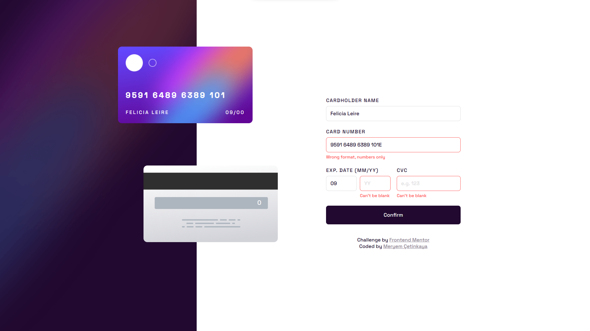
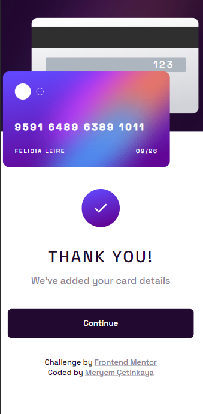

# Frontend Mentor - Interactive card details form solution

This is a solution to the [Interactive card details form challenge on Frontend Mentor](https://www.frontendmentor.io/challenges/interactive-card-details-form-XpS8cKZDWw).

## Overview

### The challenge

Users should be able to:

- Fill in the form and see the card details update in real-time
- Receive error messages when the form is submitted if:
  - Any input field is empty
  - The card number, expiry date, or CVC fields are in the wrong format
- View the optimal layout depending on their device's screen size
- See hover, active, and focus states for interactive elements on the page

### Screenshot

  
  

### Links

- Live Site URL: [https://interactive-credit-card-details-form.netlify.app//](https://interactive-credit-card-details-form.netlify.app/)

## My process

### Built with

- Semantic HTML5 markup
- CSS custom properties
- Flexbox
- Mobile-first workflow
- JavaScript

### What I learned

In this project, I learned and applied various concepts related to web development, adhering to the specified requirements:

1. **HTML Structure**:
   - I created a well-structured HTML document with semantic elements to organize content efficiently.
2. **CSS Styling**:
   - I applied CSS styles to create an attractive and user-friendly interface, including using custom fonts, colors, and borders.
   - I used CSS classes to manage error messages and provide visual cues to users about their input.
3. **Responsive Design**:
   - I created a responsive design that adapts to different screen sizes. The form and card details are presented optimally on both mobile and desktop screens. This involved using media queries to adjust the layout as needed.
4. **Interactive Elements**:
   - I added hover, active, and focus states for interactive elements, enhancing the user experience. For instance, input fields change their appearance when hovered over, and buttons provide visual feedback when clicked.
5. **Form Design and Validation**:
   - I learned how to design and style form elements effectively, and I implemented validation logic to ensure users enter correct information.
6. **Real-time Form Updates**:
   - I learned to update the card details in real-time based on the user's input. This involved dynamically updating the card number, cardholder name, expiration date, and CVC fields as the user types.
7. **JavaScript Event Handling**:
   - I improved my understanding of JavaScript event handling by attaching event listeners to various form input elements.
   - I used event listeners to handle user input and update the card details dynamically.
   - I also prevented the default form submission behavior and displayed a thank-you message upon submission.
8. **Error Handling**:
   - I implemented error handling to validate user input:
     - Ensured that any input field cannot be empty and displayed relevant error messages if they were.
     - Validated the card number, expiry date, and CVC fields to ensure they are in the correct format.
     - Displayed error messages when the user's input did not meet the required format.

Overall, this project provided valuable hands-on experience in building an interactive and responsive form, incorporating real-time updates, error handling, and a visually appealing design. It also reinforced key concepts in web development, such as HTML structure, CSS styling, and JavaScript event handling.

## Author

💼 **LinkedIn**: <a title="Meryem Çetinkaya | LinkedIn" href="https://www.linkedin.com/in/meryem-cetinkaya/" target="_blank">Meryem Çetinkaya</a> 
🐈‍⬛ **GitHub**: <a title="Meryem Çetinkaya | GitHub" href="https://github.com/meryemctnky" target="_blank">Meryem Çetinkaya</a> 
📩 **E-mail**: <a title="meryemctnkya@gmail.com" href="mailto:meryemctnkya@gmail.com" target="_blank">meryemctnkya@gmail.com</a>  
