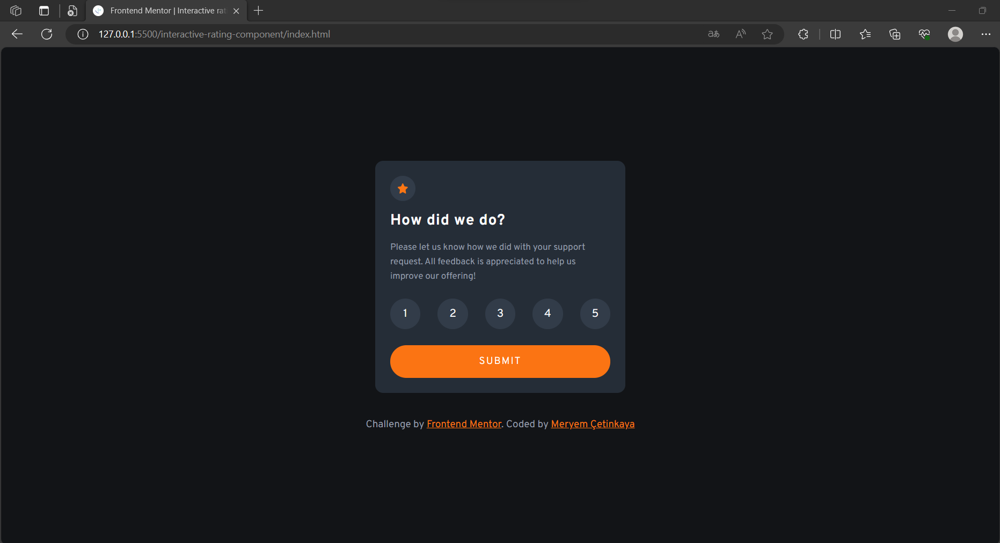
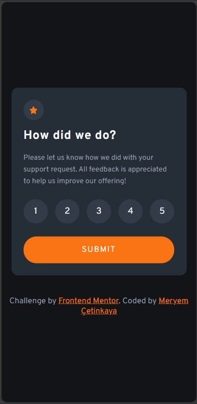

# Frontend Mentor - Interactive rating component solution

This is a solution to the [Interactive rating component challenge on Frontend Mentor](https://www.frontendmentor.io/challenges/interactive-rating-component-koxpeBUmI).

## Overview

### The challenge

Users should be able to:

- View the optimal layout for the app depending on their device's screen size
- See hover states for all interactive elements on the page
- Select and submit a number rating
- See the "Thank you" card state after submitting a rating

### Screenshot

<div class="resim-container">
  
  
</div>

### Links

- Live Site URL: [https://interactive-rating-component-0.netlify.app/](https://interactive-rating-component-0.netlify.app/)

## My process

### Built with

- Semantic HTML5 markup
- CSS custom properties
- Flexbox
- CSS Grid
- Mobile-first workflow
- Javascript

### What I learned

1. **HTML Structure**: I gained experience in structuring HTML documents with semantic tags, ensuring proper organization and accessibility of content.
2. **CSS Styling**: I applied CSS styles to create an attractive and responsive user interface. This includes using CSS variables for consistent color management and styling elements with borders, backgrounds, and padding.
3. **Flexbox Layout**: I utilized Flexbox for creating flexible and responsive layouts, allowing elements to adapt to different screen sizes and orientations.
4. **Event Handling**: I implemented event listeners in JavaScript to capture user interactions, such as clicking on star ratings and submitting feedback.
5. **DOM Manipulation**: I used JavaScript to dynamically update the Document Object Model (DOM) by changing text content, styles, and element visibility based on user actions.

   ```jsx
   const ratings = document.querySelectorAll('.ratings li');
   const submitBtn = document.getElementById('submitBtn');
   const resultText = document.getElementById('result-text');

   let selectedRating = 0;

   ratings.forEach((rating) => {
     rating.addEventListener('click', () => {
       selectedRating = parseInt(rating.getAttribute('data-rating'));
       updateSelectedRatingText();
     });
   });

   submitBtn.addEventListener('click', () => {
     resultText.textContent = `You selected ${selectedRating} out of 5`;
   });

   function updateSelectedRatingText() {
     resultText.textContent = `You selected ${selectedRating} out of 5`;
   }
   ```

6. **Interactive User Interface**: I created an interactive rating component that allows users to select a star rating and submit feedback.
7. **Conditional Display**: I employed JavaScript to conditionally display elements, such as a thank-you message and feedback details, in response to user feedback submission.
8. **Responsive Design**: I designed the project to be responsive, ensuring that it functions well on various screen sizes, from mobile devices to larger desktop screens.
9. **Color Management**: I practiced managing colors, both with predefined variables and dynamic color changes based on user interactions.
10. **Button Styling**: I styled buttons with CSS to enhance their appearance and used hover effects to provide visual feedback to users.
11. **Font Usage**: I utilized Google Fonts to enhance typography and improve the overall visual appeal of the project.
12. **Version Control**: I included a script tag to link an external JavaScript file, keeping the HTML document clean and separating structure from behavior.
13. **User Experience (UX)**: I focused on creating a positive user experience by providing clear instructions and feedback messages.
14. **Collaborative Development**: I practiced coding challenges from Frontend Mentor, which encourages collaboration and real-world project experience.

Overall, this project allowed me to strengthen my skills in HTML, CSS, and JavaScript, as well as gain practical experience in building interactive user interfaces and managing user interactions effectively.

## Author

💼 **LinkedIn**: <a title="Meryem Çetinkaya | LinkedIn" href="https://www.linkedin.com/in/meryem-cetinkaya/" target="_blank">Meryem Çetinkaya</a><br/>
🐈‍⬛ **GitHub**: <a title="Meryem Çetinkaya | GitHub" href="https://github.com/meryemctnky" target="_blank">Meryem Çetinkaya</a><br/>
📩 **E-mail**: <a title="meryemctnkya@gmail.com" href="mailto:meryemctnkya@gmail.com" target="_blank">meryemctnkya@gmail.com</a><br/><br/>
