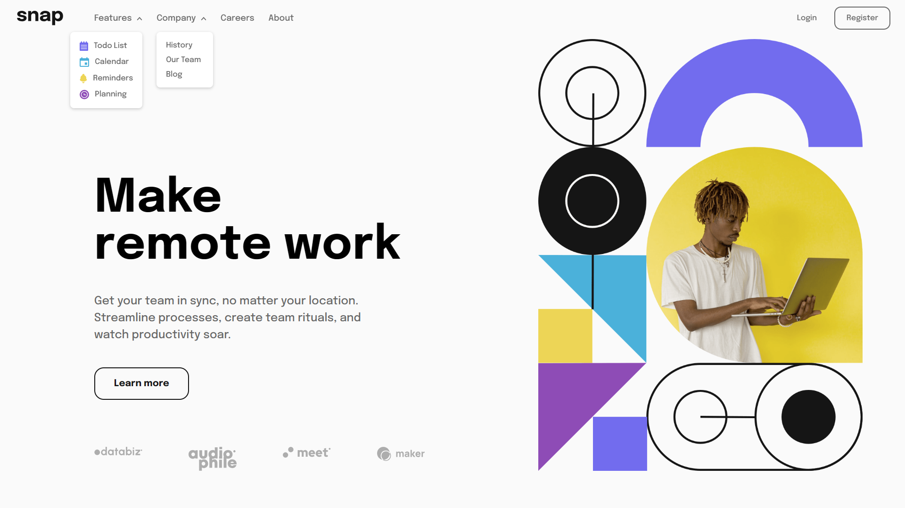
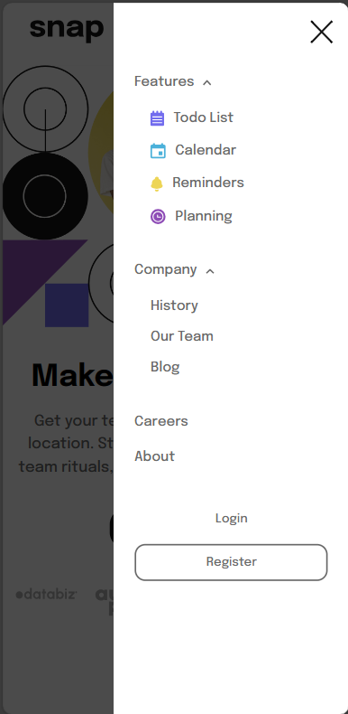

# Frontend Mentor - Intro section with dropdown navigation solution

This is a solution to the [Intro section with dropdown navigation challenge on Frontend Mentor](https://www.frontendmentor.io/challenges/intro-section-with-dropdown-navigation-ryaPetHE5).

## Overview

### The challenge

Users should be able to:

- View the relevant dropdown menus on desktop and mobile when interacting with the navigation links
- View the optimal layout for the content depending on their device's screen size
- See hover states for all interactive elements on the page

### Screenshot

  
  
  

### Links

- Live Site URL: [https://intro-section-with-dropdown-0.netlify.app/](https://intro-section-with-dropdown-0.netlify.app//)

## My process

### Built with

- Semantic HTML5 markup
- CSS custom properties
- Flexbox
- Mobile-first workflow
- JavaScript

### What I learned

In this project, I learned and implemented several key aspects to enhance user experience and responsiveness on different devices:

1. **Dropdown Navigation for Desktop and Mobile**:
   - Created a responsive navigation menu that includes dropdowns for both desktop and mobile views.
   - Implemented interactive functionality to display dropdown menus upon clicking/tapping on navigation links (Features, Company).
2. **Optimal Layout for Different Screen Sizes**:
   - Ensured the content layout adapts to various screen sizes using media queries.
   - Adjusted the navigation layout and content positioning for both desktop (min-width: 768px) and mobile views.
3. **Hover States for Interactive Elements**:
   - Applied hover states for interactive elements like navigation links and buttons to enhance user feedback and visual interactivity.
4. **HTML Structure**:
   - Utilized semantic HTML elements to organize content efficiently and enhance accessibility.
5. **CSS Styling**:
   - Styled the navigation menu, dropdowns, buttons, and content sections using CSS to achieve a visually appealing and responsive design.
6. **JavaScript Functionality**:
   - Implemented JavaScript event listeners to handle dropdown visibility for the Features and Company navigation items.
   - Utilized JavaScript to manage the off-canvas menu functionality, toggling its visibility on mobile devices and ensuring proper interaction.
7. **Overlay Functionality**:
   - Created an overlay to cover the content when the off-canvas menu is active on mobile devices, providing a clearer focus on the menu.
8. **Event Handling:**
   - Event listeners were added to the dropdown buttons and toggle button, enabling the opening and closing of the dropdown menus and off-canvas navigation on user clicks.
9. **Media Queries and Responsive Design**:
   - Used media queries to adjust the layout, positioning, and styling of elements to provide an optimal viewing experience on both desktop and mobile devices.
10. **Accessibility and User Interaction**:
    - Enhanced user interaction by making the navigation elements accessible and easy to use on different devices.

This project allowed me to gain practical experience in building a responsive and interactive navigation system, handling dropdowns, and ensuring a seamless user experience across various screen sizes and devices.

## Author

💼 **LinkedIn**: <a title="Meryem Çetinkaya | LinkedIn" href="https://www.linkedin.com/in/meryem-cetinkaya/" target="_blank">Meryem Çetinkaya</a> 
🐈‍⬛ **GitHub**: <a title="Meryem Çetinkaya | GitHub" href="https://github.com/meryemctnky" target="_blank">Meryem Çetinkaya</a> 
📩 **E-mail**: <a title="meryemctnkya@gmail.com" href="mailto:meryemctnkya@gmail.com" target="_blank">meryemctnkya@gmail.com</a>  
