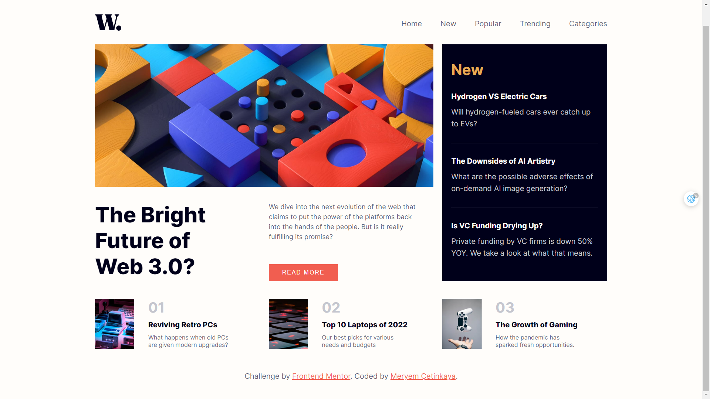
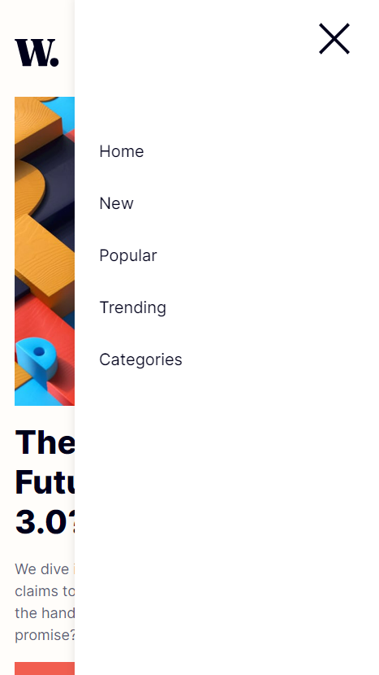

# Frontend Mentor - News homepage solution

This is a solution to the [News homepage challenge on Frontend Mentor](https://www.frontendmentor.io/challenges/news-homepage-H6SWTa1MFl).

## Overview

### The challenge

Users should be able to:

- View the optimal layout for the interface depending on their device's screen size
- See hover and focus states for all interactive elements on the page

### Screenshot

  
  

### Links

- Live Site URL: [https://news-homepage-0.netlify.app/](https://news-homepage-0.netlify.app/)

## My process

### Built with

- Semantic HTML5 markup
- CSS custom properties
- Flexbox
- CSS Grid
- Mobile-first workflow
- JavaScript

### What I learned

Through this project, I gained valuable insights and practical experience in various aspects of web development. Here are some of the key learnings from this project:

1. **Responsive Design**: I learned how to create a responsive layout using CSS grid and media queries. This allowed me to ensure that the content is accessible and well-structured across different screen sizes, optimizing the user experience.
2. **CSS Styling**: I gained proficiency in CSS styling techniques, such as customizing fonts, colors, and layouts. I utilized CSS properties like **`background-color`**, **`font-size`**, **`padding`**, and **`color`** to create an aesthetically pleasing and user-friendly interface.
3. **DOM Manipulation**: I acquired a strong understanding of DOM manipulation using JavaScript. By leveraging event listeners and manipulating the DOM, I implemented interactive features like the off-canvas menu, enabling users to toggle the navigation menu on smaller screens.
4. **Navigation Implementation**: I implemented a navigation system with a toggle button and a close button for the off-canvas menu. This helped me understand how to manage and control the display of navigation elements based on user interactions.
5. **HTML Semantics**: I grasped the importance of using semantic HTML elements to enhance the accessibility and search engine optimization (SEO) of the website. By using tags like **`<nav>`**, **`<section>`**, and **`<article>`**, I improved the structure and readability of the content.
6. **Image Handling**: I learned how to manage images effectively by using the **`<picture>`** element and the **`srcset`** attribute, which allowed me to provide different image sources based on the user's device resolution. This optimization helps improve the website's loading speed and performance.
7. **Version Control and Collaboration**: I practiced version control using Git, which enabled me to keep track of changes and collaborate effectively with team members. By committing changes and pushing them to a remote repository, I ensured a systematic approach to managing the project.
8. **UI/UX Principles**: I applied fundamental UI/UX principles to create an engaging and visually appealing user interface. By considering factors like color contrast, typography, and interactive elements, I enhanced the overall user experience and usability of the website.
9. **External Resource Integration**: I integrated external resources such as Google Fonts and image assets into the project. This experience helped me understand how to leverage external libraries and resources to enhance the design and functionality of the website.

Overall, this project enhanced my skills in responsive design, CSS styling, DOM manipulation, and the implementation of interactive features. It also improved my understanding of HTML semantics, image optimization, version control, UI/UX principles, and external resource integration.

## Author

💼 **LinkedIn**: <a title="Meryem Çetinkaya | LinkedIn" href="https://www.linkedin.com/in/meryem-cetinkaya/" target="_blank">Meryem Çetinkaya</a> 
🐈‍⬛ **GitHub**: <a title="Meryem Çetinkaya | GitHub" href="https://github.com/meryemctnky" target="_blank">Meryem Çetinkaya</a> 
📩 **E-mail**: <a title="meryemctnkya@gmail.com" href="mailto:meryemctnkya@gmail.com" target="_blank">meryemctnkya@gmail.com</a>  
