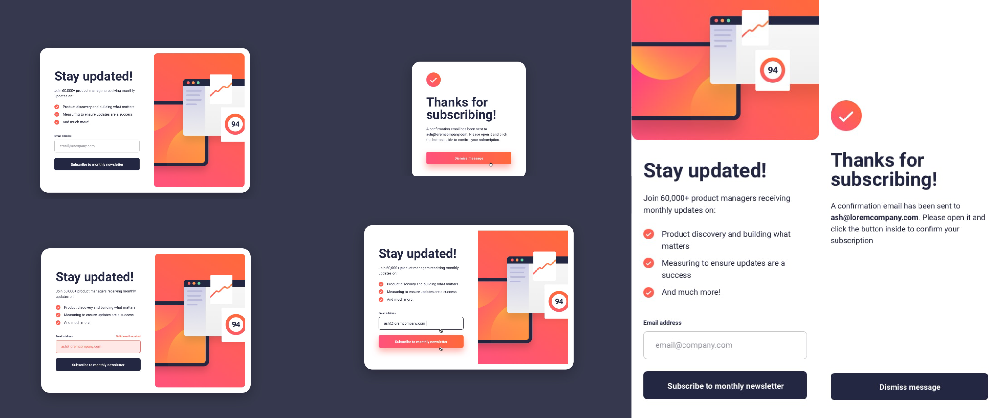

# Frontend Mentor - Newsletter sign-up form with success message solution

This is a solution to the [Newsletter sign-up form with success message challenge on Frontend Mentor](https://www.frontendmentor.io/challenges/newsletter-signup-form-with-success-message-3FC1AZbNrv).

## Overview

### The challenge

Users should be able to:

- Add their email and submit the form
- See a success message with their email after successfully submitting the form
- See form validation messages if:
  - The field is left empty
  - The email address is not formatted correctly
- View the optimal layout for the interface depending on their device's screen size
- See hover and focus states for all interactive elements on the page

### Screenshot

  

### Links

- Live Site URL: [https://ping-coming-soon-page-0.netlify.app/](https://ping-coming-soon-page-0.netlify.app/)

## My process

### Built with

- Semantic HTML5 markup
- CSS custom properties
- Flexbox
- CSS Grid
- Mobile-first workflow
- JavaScript

### What I learned

In this project, I've learned several valuable skills, particularly in JavaScript development. Here's a summary of what I've learned:

**HTML & CSS Skills:**

1. **HTML Structure**: I've strengthened my ability to create well-structured HTML documents, including semantic elements and proper nesting of tags.
2. **CSS Styling**: I've improved my CSS skills by styling the webpage, including fonts, colors, layouts, and responsive design using media queries.
3. **CSS Variables**: I've used CSS variables (:root) to manage and maintain consistent color schemes throughout the project.
4. **Flexbox**: I've implemented flexbox for creating flexible and responsive layouts, making it easier to align and distribute content.

**JavaScript Skills:**

5. **DOM Manipulation**: I've gained a deeper understanding of the Document Object Model (DOM) and used JavaScript to interact with and manipulate DOM elements dynamically. I targeted specific elements using methods like **`getElementById`** and **`querySelector`** and updated their properties to control the display of different sections based on user actions.

   1. **Form Validation**: I've learned how to validate form inputs, checking for valid email addresses and providing error messages when necessary. This knowledge is essential for creating user-friendly forms.
   1. **Event Handling**: I deepened my understanding of handling form submissions in JavaScript. I utilized the **`addEventListener`** method to capture the form submission event and prevent the default behavior using **`preventDefault()`**.
   1. **Regular Expressions**: I've utilized regular expressions (Regex) to validate email addresses, which is a powerful technique for complex pattern matching in form validation.
   1. **Conditional Logic**: I've applied conditional logic in JavaScript to control the behavior of the webpage, switching between the subscription form and the success message based on user input.
   1. **Error Handling**: I've integrated error handling mechanisms, such as adding error classes and displaying error messages, to ensure a smooth user experience when dealing with form submission errors.
   1. **Error Messaging**: I integrated error messaging functionality to provide users with clear feedback when they input invalid data. By manipulating the display of error messages, I enhanced the user experience and provided helpful guidance for correcting input mistakes.
   1. **Element Visibility**: I've learned how to control the visibility of HTML elements using JavaScript to display the success message and hide the subscription form when needed.
   1. **Dynamic CSS Manipulation**: I practiced dynamically adding and removing CSS classes to manipulate the visual appearance of elements based on user input. This technique enabled me to visually indicate form input errors by adding an error class to the input field.

Overall, this project has significantly improved my JavaScript skills, especially in the context of DOM manipulation, form validation, and event handling. Additionally, I've reinforced my knowledge of HTML and CSS for creating modern and responsive web applications.

## Author

💼 **LinkedIn**: <a title="Meryem Çetinkaya | LinkedIn" href="https://www.linkedin.com/in/meryem-cetinkaya/" target="_blank">Meryem Çetinkaya</a> 
🐈‍⬛ **GitHub**: <a title="Meryem Çetinkaya | GitHub" href="https://github.com/meryemctnky" target="_blank">Meryem Çetinkaya</a> 
📩 **E-mail**: <a title="meryemctnkya@gmail.com" href="mailto:meryemctnkya@gmail.com" target="_blank">meryemctnkya@gmail.com</a>  
