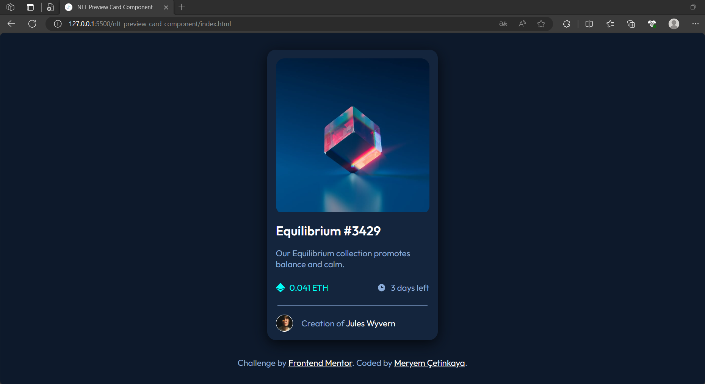
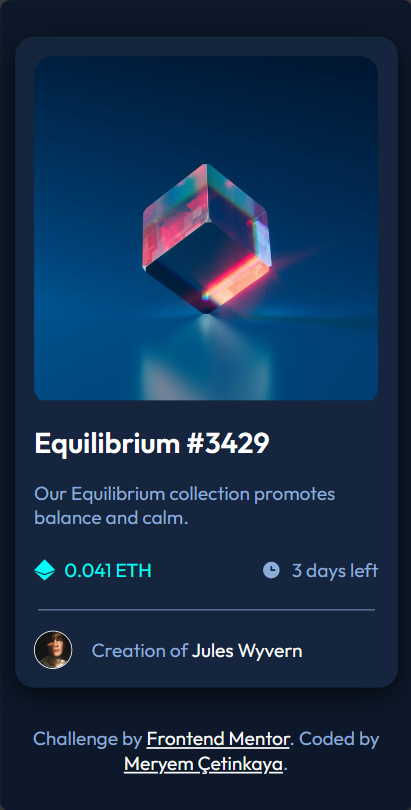

# Frontend Mentor - NFT preview card component

This is a solution to the [NFT preview card component challenge on Frontend Mentor](https://www.frontendmentor.io/challenges/nft-preview-card-component-SbdUL_w0U).

## Overview

### The challenge

Users should be able to:

- View the optimal layout for the interface depending on their device's screen size
- See hover and focus states for all interactive elements on the page

### Screenshot

  
  

### Links

<!-- - Live Site URL: [Add live site URL here](https://your-live-site-url.com) -->

## My process

### Built with

- Semantic HTML5 markup
- CSS custom properties
- Flexbox
- CSS Grid
- Mobile-first workflow

### What I learned

**1. HTML Structure:** I learned how to create the basic structure of an HTML document, including setting the document type, defining the language, and adding metadata like character encoding and viewport settings.

**2. Favicon:** I learned how to add a favicon to the webpage, which is a small icon that appears in the browser tab. This enhances the branding and recognition of the website.

**3. External Fonts:** I gained experience in importing and applying external fonts from Google Fonts using the <link> tag in the HTML head, allowing for custom typography in the project.

**4. Responsive Design:** I learned how to create a responsive design that adapts to various screen sizes and devices, ensuring a consistent and user-friendly experience for users.

**5. CSS Styling:** I developed skills in applying CSS styles to HTML elements to create an attractive and responsive NFT preview card. This includes defining custom CSS variables for consistent color management.

**6. Hover Effects:** I implemented hover effects using CSS to enhance interactivity, such as changing colors and opacity when hovering over the card's image and title.

**7. Typography:** I adjusted font sizes, weights, and colors to improve readability and visual appeal, utilizing custom fonts for headings.

**8. Layout and Spacing:** I applied CSS properties to control the layout of elements within the card, including padding, margins, and spacing, to achieve a visually pleasing design.

**9. Card Shadow and Border Radius:** I utilized CSS to add shadow and rounded corners to the card, giving it a three-dimensional appearance and a softer, modern look.
**10. Interactive Elements:** I added interactive elements to the card, such as clickable titles and avatars, with color changes on hover to provide feedback to users.

## Author

💼 **LinkedIn**: <a title="Meryem Çetinkaya | LinkedIn" href="https://www.linkedin.com/in/meryem-cetinkaya/" target="_blank">Meryem Çetinkaya</a> 
🐈‍⬛ **GitHub**: <a title="Meryem Çetinkaya | GitHub" href="https://github.com/meryemctnky" target="_blank">Meryem Çetinkaya</a> 
📩 **E-mail**: <a title="meryemctnkya@gmail.com" href="mailto:meryemctnkya@gmail.com" target="_blank">meryemctnkya@gmail.com</a>  
