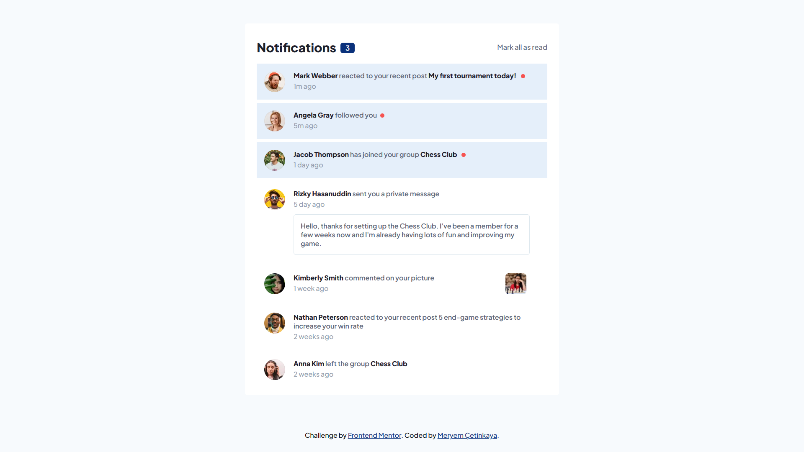
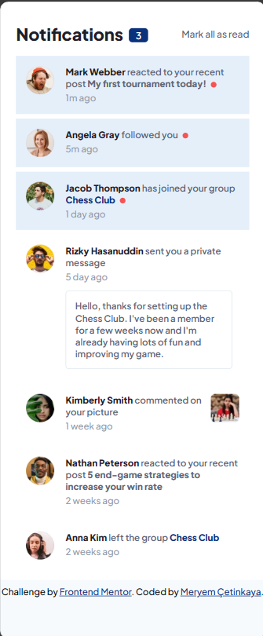

# Frontend Mentor - Notifications page solution

This is a solution to the [Notifications page challenge on Frontend Mentor](https://www.frontendmentor.io/challenges/notifications-page-DqK5QAmKbC).

## Overview

### The challenge

Users should be able to:

- Distinguish between "unread" and "read" notifications
- Select "Mark all as read" to toggle the visual state of the unread notifications and set the number of unread messages to zero
- View the optimal layout for the interface depending on their device's screen size
- See hover and focus states for all interactive elements on the page

### Screenshot

  
  

### Links

- Live Site URL: [https://notifications-page-0.netlify.app/](https://notifications-page-0.netlify.app/)

## My process

### Built with

- Semantic HTML5 markup
- CSS custom properties
- Flexbox
- Mobile-first workflow
- JavaScript

### What I learned

In this project, I learned and applied various concepts related to web development. Here's what I learned:

1. **HTML Structure**: I gained experience in creating well-structured HTML documents with proper use of semantic elements. The use of headings, paragraphs, and links in the notifications demonstrates the importance of semantic HTML for accessibility and SEO.
2. **CSS Styling and Layout**: I improved my CSS skills for styling web pages. I learned how to use CSS properties like **`background-color`**, **`color`**, **`font-size`**, and **`border-radius`** to create a visually appealing design. The project's responsive layout showcases the importance of CSS in creating adaptable designs for different screen sizes.
3. **CSS Custom Properties (Variables)**: I used CSS custom properties (variables) to define and manage color values and other design-related properties. This approach promotes consistency and simplifies the process of updating the design.
4. **Flexbox and Grid**: I applied CSS Flexbox and Grid layouts for organizing and positioning elements on the page. This includes arranging items in the header and the notification list.
5. **Interactive Web Pages**: I implemented JavaScript to add interactivity to the web page. This includes marking notifications as "read" when clicked and providing the option to mark all notifications as "read." JavaScript event listeners and DOM manipulation were used to achieve this.
6. **Event Handling**: I gained a better understanding of event handling in JavaScript by attaching event listeners to DOM elements. In this case, I used event listeners to respond to user interactions, such as clicks on notifications and the "Mark all as read" button.
7. **Optimizing Images**: I learned to optimize images for web use, ensuring that they load quickly and efficiently. This is important for improving page load performance and user experience.
8. **Linking and Navigation**: The project demonstrates linking between different parts of the website, including anchor links within notifications. This enhances the user's ability to navigate the content.

Overall, this project provided practical experience in creating a responsive and interactive web page, incorporating HTML for content structure, CSS for styling, and JavaScript for enhancing user experience. It also reinforced the use of semantic HTML and well-organized CSS, along with event handling and DOM manipulation in JavaScript.

## Author

💼 **LinkedIn**: <a title="Meryem Çetinkaya | LinkedIn" href="https://www.linkedin.com/in/meryem-cetinkaya/" target="_blank">Meryem Çetinkaya</a> 
🐈‍⬛ **GitHub**: <a title="Meryem Çetinkaya | GitHub" href="https://github.com/meryemctnky" target="_blank">Meryem Çetinkaya</a> 
📩 **E-mail**: <a title="meryemctnkya@gmail.com" href="mailto:meryemctnkya@gmail.com" target="_blank">meryemctnkya@gmail.com</a>  
