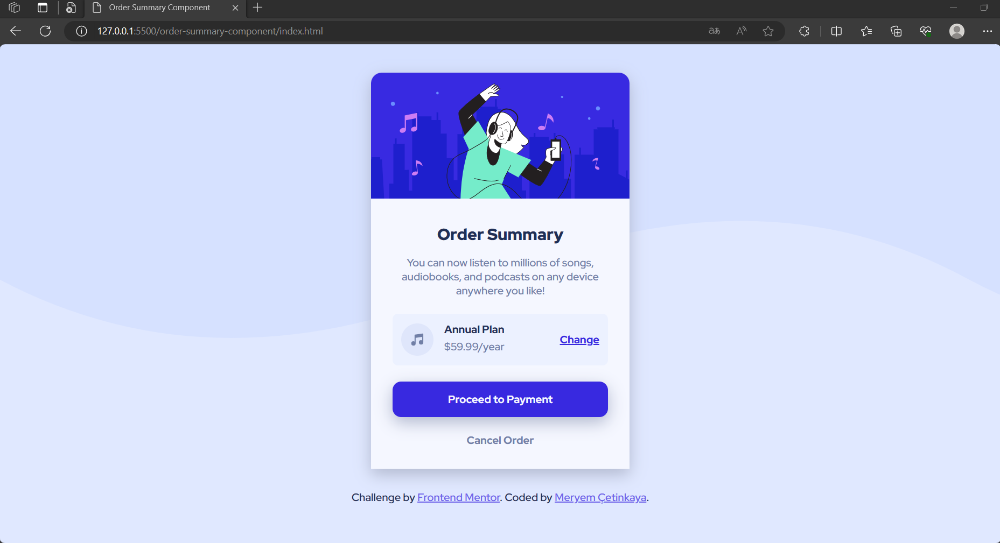

# Frontend Mentor - Order summary card

This is a solution to the [Order summary card challenge on Frontend Mentor](https://www.frontendmentor.io/challenges/order-summary-component-QlPmajDUj).

## Overview

### The challenge

Users should be able to:

- View the optimal layout for the interface depending on their device's screen size
- See hover and focus states for all interactive elements on the page

### Screenshot

  
  

### Links

- Live Site URL: [https://order-summary-card-1.netlify.app](https://order-summary-card-1.netlify.app)

## My process

### Built with

- Semantic HTML5 markup
- CSS custom properties
- Flexbox
- CSS Grid
- Mobile-first workflow

### What I learned

In this project, I learned the following:

**1. HTML Structure:** I gained experience in creating the basic structure of an HTML document, including specifying the document type, defining the language, and adding metadata like character encoding and viewport settings.

**2. External Fonts:** I learned how to import and apply external fonts from Google Fonts using the <link> tag in the HTML head, enabling the use of custom typography in the project.

**3. CSS Styling:** I developed skills in applying CSS styles to HTML elements to create an appealing and functional order summary component. This includes defining custom CSS variables for color management.

**4. Responsive Design:** I learned how to design a responsive layout that adapts to various screen sizes and devices, ensuring a consistent user experience.

**5. Box Model:** I applied the CSS box model, including margin, padding, and border properties, to control the spacing and layout of elements within the card.

**6. Flexbox:** I utilized CSS flexbox to create flexible and aligned layouts, particularly in the content-footer section where elements are distributed evenly.

**7. Hover Effects:** I implemented hover effects using CSS to enhance interactivity, such as changing colors and adding hover styles to clickable elements.

**8. Button Styling:** I learned how to style buttons with background colors, borders, and hover effects, making them visually appealing and interactive.

**9. Background Image:** I used a background image to enhance the visual aesthetics of the project, providing a patterned background that repeats horizontally.

**10. Footer:** I created a footer section with attribution links, giving credit to the challenge source and acknowledging the coder of the project, which is a common practice in web development.

Overall, this project helped me develop skills in HTML structure, CSS styling, responsive design, typography, and the use of external fonts, enabling me to create an attractive and functional order summary component for the web.

## Author

💼 **LinkedIn**: <a title="Meryem Çetinkaya | LinkedIn" href="https://www.linkedin.com/in/meryem-cetinkaya/" target="_blank">Meryem Çetinkaya</a> 
🐈‍⬛ **GitHub**: <a title="Meryem Çetinkaya | GitHub" href="https://github.com/meryemctnky" target="_blank">Meryem Çetinkaya</a> 
📩 **E-mail**: <a title="meryemctnkya@gmail.com" href="mailto:meryemctnkya@gmail.com" target="_blank">meryemctnkya@gmail.com</a>  
