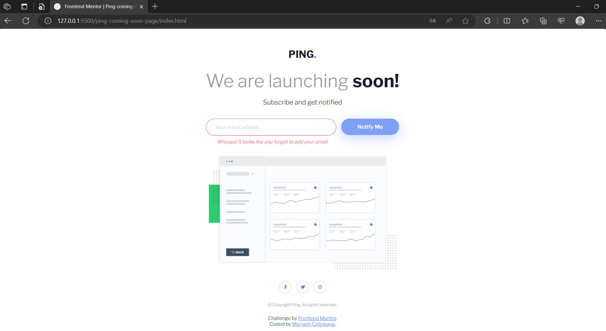

# Frontend Mentor - Intro component with sign up form solution

This is a solution to the [Ping coming soon page challenge on Frontend Mentor](https://www.frontendmentor.io/challenges/ping-single-column-coming-soon-page-5cadd051fec04111f7b848da).

## Overview

### The challenge

Users should be able to:

- View the optimal layout for the site depending on their device's screen size
- See hover states for all interactive elements on the page
- Submit their email address using an `input` field
- Receive an error message when the `form` is submitted if:
  - The `input` field is empty. The message for this error should say _"Whoops! It looks like you forgot to add your email"_
  - The email address is not formatted correctly (i.e. a correct email address should have this structure: `name@host.tld`). The message for this error should say _"Please provide a valid email address"_

### Screenshot

  
  

### Links

- Live Site URL: [https://ping-coming-soon-page-0.netlify.app/](https://ping-coming-soon-page-0.netlify.app/)

## My process

### Built with

- Semantic HTML5 markup
- CSS custom properties
- Flexbox
- CSS Grid
- Mobile-first workflow
- JavaScript

### What I learned

In this project, I learned the following, with a specific focus on JavaScript:

1. **HTML and CSS Structure**: I practiced creating a responsive webpage using HTML and CSS. This involved setting up the layout and styling elements to ensure an aesthetically pleasing design.
2. **DOM Manipulation**: I deepened my understanding of the Document Object Model (DOM) and its manipulation using JavaScript. I used DOM methods to interact with various elements and dynamically modify their properties based on user actions.
3. **Form Validation**: I learned about form validation techniques using JavaScript. I implemented form validation logic to ensure that user-provided data meets specific criteria, such as checking for valid email formats and handling empty input fields.
4. **Event Handling**: I explored event handling in JavaScript, specifically focusing on form submissions. I used event listeners to capture form submission events and implemented custom validation logic to handle form errors and prevent default form submission behavior.
5. **Regular Expressions**: I utilized regular expressions to validate email addresses. This technique allowed me to perform complex pattern matching and ensure that the email input follows the correct format.
6. **Error Handling and Visual Feedback**: I integrated error handling mechanisms and provided visual feedback to users when they submit invalid form data. This involved displaying error messages and adjusting the border color of input fields to indicate erroneous inputs.
7. **Responsive Design**: I applied responsive design principles to ensure that the webpage renders well across different device sizes. I used media queries to adapt the layout and styling for various screen dimensions, creating a consistent user experience.
8. **External Resources**: You included external resources like the Font Awesome icon library and Google Fonts for enhanced functionality and typography choices.

Overall, this project significantly enhanced my JavaScript skills, especially in the context of form validation, DOM manipulation, event handling, and error feedback mechanisms.

## Author

💼 **LinkedIn**: <a title="Meryem Çetinkaya | LinkedIn" href="https://www.linkedin.com/in/meryem-cetinkaya/" target="_blank">Meryem Çetinkaya</a> 
🐈‍⬛ **GitHub**: <a title="Meryem Çetinkaya | GitHub" href="https://github.com/meryemctnky" target="_blank">Meryem Çetinkaya</a> 
📩 **E-mail**: <a title="meryemctnkya@gmail.com" href="mailto:meryemctnkya@gmail.com" target="_blank">meryemctnkya@gmail.com</a>  
