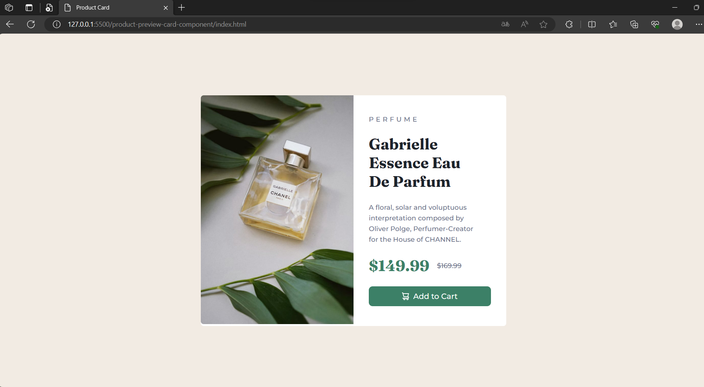

# Frontend Mentor - Product preview card component

This is a solution to the [Product preview card component challenge on Frontend Mentor](https://www.frontendmentor.io/challenges/product-preview-card-component-GO7UmttRfa).

## Overview

### The challenge

Users should be able to:

- View the optimal layout for the interface depending on their device's screen size
- See hover and focus states for all interactive elements on the page

### Screenshot

  
  

### Links

<!-- - Live Site URL: [Add live site URL here](https://your-live-site-url.com) -->

## My process

### Built with

- Semantic HTML5 markup
- CSS custom properties
- Flexbox
- CSS Grid
- Mobile-first workflow

### What I learned

**1. HTML Structure:** I learned how to create the basic structure of an HTML document, including setting the document type, defining the language, and adding metadata like character encoding and viewport settings.

**2. CSS Styling:** I gained experience in applying CSS styles to HTML elements to create an attractive and responsive product card. This includes defining custom CSS variables for consistent color management.

**3. Use of CSS Variables:** I utilized CSS variables to store and manage color values, making it easier to maintain a consistent color scheme throughout the project.

**4. CSS Flexbox:** I learned how to use CSS flexbox to create a flexible layout for the card, allowing for dynamic content arrangement and alignment.

**5. Typography:** I utilized custom fonts for headings and adjusted font sizes and styles to enhance the readability and visual appeal of the product card.

**6. Layout and Spacing:** I employed CSS properties to control the layout of the elements within the card, including spacing, margins, and padding for achieving a visually pleasing design.

**7. Media Queries:** I applied media queries to adjust the layout and styles of the card for different screen sizes, making the card responsive and user-friendly on both desktop and mobile devices.

**8. Button Styling:** I learned how to style buttons with background colors, borders, and hover effects, creating an interactive and engaging user interface element.

Overall, this project helped me develop skills in HTML structure, CSS styling, responsive design, and the use of external fonts, enabling me to create an appealing and functional product card for the web.

## Author

💼 **LinkedIn**: <a title="Meryem Çetinkaya | LinkedIn" href="https://www.linkedin.com/in/meryem-cetinkaya/" target="_blank">Meryem Çetinkaya</a> 
🐈‍⬛ **GitHub**: <a title="Meryem Çetinkaya | GitHub" href="https://github.com/meryemctnky" target="_blank">Meryem Çetinkaya</a> 
📩 **E-mail**: <a title="meryemctnkya@gmail.com" href="mailto:meryemctnkya@gmail.com" target="_blank">meryemctnkya@gmail.com</a>  
