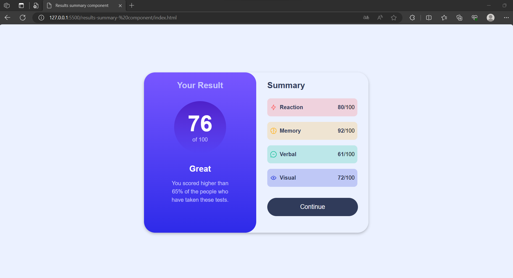

# Frontend Mentor - Results summary component solution

This is a solution to the [Results summary component challenge on Frontend Mentor](https://www.frontendmentor.io/challenges/results-summary-component-CE_K6s0maV).

## Overview

### The challenge

Users should be able to:

- View the optimal layout for the interface depending on their device's screen size
- See hover and focus states for all interactive elements on the page
- **Bonus**: Use the local JSON data to dynamically populate the content

### Screenshot

  
  

### Links

<!-- - Live Site URL: [Add live site URL here](https://your-live-site-url.com) -->

## My process

### Built with

- Semantic HTML5 markup
- CSS custom properties
- Flexbox
- CSS Grid
- Mobile-first workflow

### What I learned

**1. HTML Structure:** I learned how to create the basic structure of an HTML document using the `<!DOCTYPE html>, <html>, <head>, and <body> `elements. I also learned how to include external CSS and JavaScript files using the `<link> and <script>` tags.

**2. Meta Tags:** I learned how to use meta tags to set the character encoding and viewport for the web page.

**3. Font Integration:** I learned how to integrate external fonts from Google Fonts into a web page using the `<link>` tag.

**4. CSS Styling:** I learned how to apply CSS styles to HTML elements to create a visually appealing and responsive layout. This includes setting up classes, defining styles in an external CSS file, and using CSS flexbox for layout.

**5. Custom CSS Variables:** Custom CSS variables are defined using the :root pseudo-class. These variables store color values that are used **throughout the stylesheet. This approach makes it easy to maintain and update the color scheme of the page.
**
**6. Global Reset:** The `*` selector is used to reset the default margin and padding for all elements to zero, ensuring a consistent layout.

**7. Fetching Data:** I learned how to use JavaScript to fetch data from an external source (in this case, a JSON file) using the fetch API. I also learned how to handle HTTP errors and parse JSON data.

**8. Dynamic Content:** I learned how to dynamically create and manipulate HTML elements using JavaScript. In this project, I created rows of content based on the fetched data and added them to the DOM.

**9. Error Handling:** I learned how to implement error handling in JavaScript to catch and log errors that may occur during data fetching and processing.

**10. Event Handling:** Although not explicitly shown in the provided code, I learned how to handle events in JavaScript, such as button clicks, and how to respond to user interactions.

**11. Project Structure:** I gained an understanding of organizing project files and directories, separating HTML, CSS, and JavaScript into separate files for better maintainability.

**12. Media Query:** A media query is used to apply different styles when the screen width is 650 pixels or less. In this case, the layout is adjusted for smaller screens, and the background color is changed to white. The card also loses its box shadow, and the sections take up 100% of the width.

Overall, this project allowed me to apply my knowledge of HTML, CSS, and JavaScript to create a results summary component that fetches and displays data dynamically on a web page, enhancing my web development skills.

## Author

💼 **LinkedIn**: <a title="Meryem Çetinkaya | LinkedIn" href="https://www.linkedin.com/in/meryem-cetinkaya/" target="_blank">Meryem Çetinkaya</a> 
🐈‍⬛ **GitHub**: <a title="Meryem Çetinkaya | GitHub" href="https://github.com/meryemctnky" target="_blank">Meryem Çetinkaya</a> 
📩 **E-mail**: <a title="meryemctnkya@gmail.com" href="mailto:meryemctnkya@gmail.com" target="_blank">meryemctnkya@gmail.com</a>  
