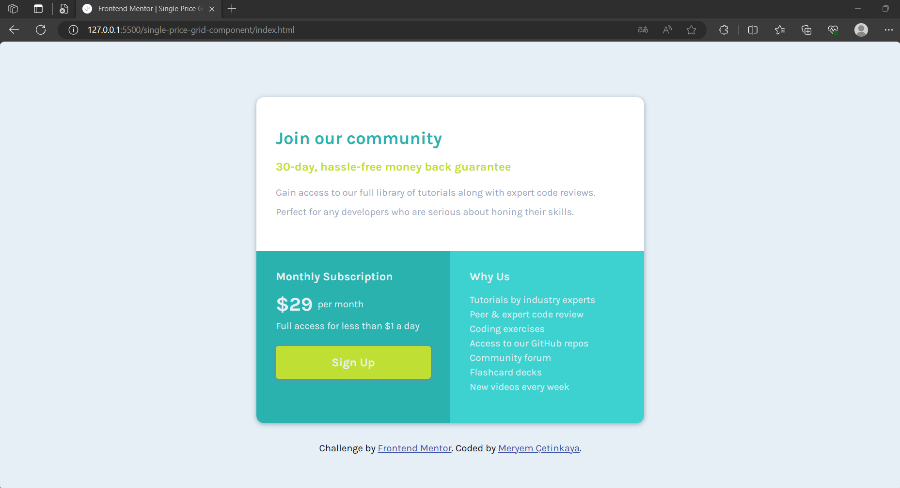

# Frontend Mentor - Single price grid component solution

This is a solution to the [Single price grid component challenge on Frontend Mentor](https://www.frontendmentor.io/challenges/single-price-grid-component-5ce41129d0ff452fec5abbbc).

## Overview

### The challenge

Users should be able to:

- View the optimal layout for the interface depending on their device's screen size
- See a hover state on desktop for the Sign Up call-to-action

### Screenshot

  
  

### Links

- Live Site URL: [https://single-price-grid-component-3.netlify.app/](https://single-price-grid-component-3.netlify.app/)

## My process

### Built with

- Semantic HTML5 markup
- CSS custom properties
- Flexbox
- CSS Grid
- Mobile-first workflow

### What I learned

In this project, I learned the following:

1. **CSS Styling**: This project has allowed me to practice CSS styling extensively. I applied various styles, such as backgrounds, borders, and shadows, to create a visually appealing single price grid component. CSS variables helped me maintain consistent colors and typography throughout the project.
2. **Responsive Design**: I've gained hands-on experience in making web pages responsive. Using media queries, I ensured that the layout adjusts gracefully to different screen sizes, optimizing the user experience both on desktop and mobile devices.
3. **Typography**: I utilized custom fonts from Google Fonts, adjusting font weights and styles to achieve a harmonious and visually pleasing typography design.
4. **Flexbox and Grid**: I used CSS Flexbox and Grid layouts for organizing content and achieving the desired card layout with proper alignments.
5. **Button Styling**: I learned how to style buttons effectively, enhancing their appearance with background colors, hover effects, and box shadows.
6. **List Styling**: I customized list styles and line heights to create an aesthetically pleasing and readable list of features.
7. **Box Model**: I applied box model properties, such as padding and margin, to control the spacing and layout of elements, ensuring a polished look.
8. **Conditional Styling**: I utilized conditional CSS classes like **`.cyan`** and **`.aqua`** to provide distinct visual styles to specific sections of the grid component.
9. **Linking**: I included attribution links in the footer, providing credit to Frontend Mentor and acknowledging my own work on the project.
10. **Cross-browser Compatibility**: While not explicitly mentioned, I ensured that my project is cross-browser compatible, considering potential differences in rendering across various web browsers.

Overall, this project has strengthened my front-end development skills, from HTML structure and CSS styling to responsive design and typography choices. It's been a valuable opportunity to apply these skills to create a functional and visually appealing single price grid component.

## Author

💼 **LinkedIn**: <a title="Meryem Çetinkaya | LinkedIn" href="https://www.linkedin.com/in/meryem-cetinkaya/" target="_blank">Meryem Çetinkaya</a> 
🐈‍⬛ **GitHub**: <a title="Meryem Çetinkaya | GitHub" href="https://github.com/meryemctnky" target="_blank">Meryem Çetinkaya</a> 
📩 **E-mail**: <a title="meryemctnkya@gmail.com" href="mailto:meryemctnkya@gmail.com" target="_blank">meryemctnkya@gmail.com</a>  
