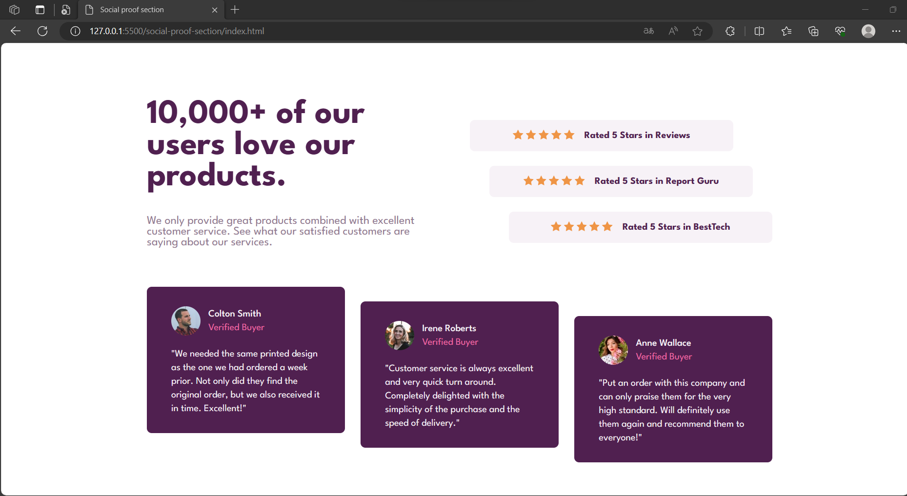

# Frontend Mentor - Social proof section

This is a solution to the [Social proof section challenge on Frontend Mentor](https://www.frontendmentor.io/challenges/social-proof-section-6e0qTv_bA).

## Overview

### The challenge

Users should be able to:

- View the optimal layout for the interface depending on their device's screen size

### Screenshot

  
  

### Links

- Live Site URL: [https://social-proof-section-9.netlify.app](https://social-proof-section-9.netlify.app)

## My process

### Built with

- Semantic HTML5 markup
- CSS custom properties
- Flexbox
- CSS Grid
- Mobile-first workflow

### What I learned

In this project, I learned the following:

1. **HTML Structure**: I gained experience in structuring an HTML document, including defining the document type, specifying character encoding, and setting up the viewport for responsive design.
2. **CSS Styling**: I learned how to apply CSS styles to create an attractive and user-friendly social proof section. This included defining custom CSS variables for color management.
3. **Grid Layout**: I used CSS Grid to create a responsive layout for the main content, allowing for easy arrangement of elements in a grid pattern.
4. **Flexbox**: I applied Flexbox for aligning and positioning elements within the rating container and reviews section, ensuring proper alignment and spacing.
5. **Background Images**: I used background images to enhance the visual appeal of the project, creating a patterned background that adapts to different screen sizes.
6. **Responsive Design**: I designed the project to be responsive, adjusting the layout and styles for different screen sizes, including mobile devices.
7. **Typography**: I applied custom fonts from Google Fonts, changing the typography to match the project's design requirements.
8. **Hover Effects**: I implemented hover effects for interactive elements, such as the star ratings and links, to improve user experience.
9. **Media Queries**: I used media queries to apply specific styles for screens with a maximum width of 768px, optimizing the design for mobile devices.
10. **Card Layout**: I created a card layout for displaying customer reviews, including images, names, and comments, making use of CSS styles for consistent and appealing card designs.

Overall, this project allowed me to develop skills in HTML structure, CSS styling, responsive design, grid layout, Flexbox, and the use of background images, enabling me to create an engaging and well-designed social proof section for a website.

## Author

💼 **LinkedIn**: <a title="Meryem Çetinkaya | LinkedIn" href="https://www.linkedin.com/in/meryem-cetinkaya/" target="_blank">Meryem Çetinkaya</a> 
🐈‍⬛ **GitHub**: <a title="Meryem Çetinkaya | GitHub" href="https://github.com/meryemctnky" target="_blank">Meryem Çetinkaya</a> 
📩 **E-mail**: <a title="meryemctnkya@gmail.com" href="mailto:meryemctnkya@gmail.com" target="_blank">meryemctnkya@gmail.com</a>  
