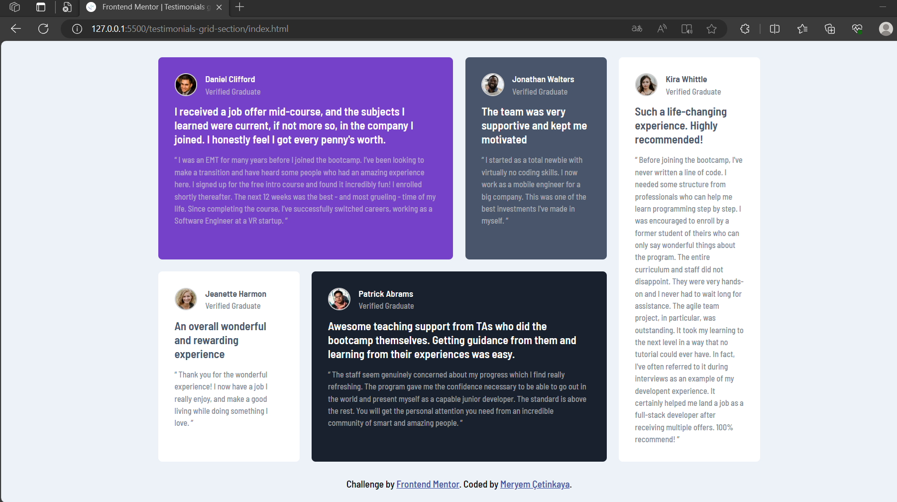

# Frontend Mentor - Testimonials grid section solution

This is a solution to the [Testimonials grid section challenge on Frontend Mentor](https://www.frontendmentor.io/challenges/testimonials-grid-section-Nnw6J7Un7).

## Overview

### The challenge

Users should be able to:

- View the optimal layout for the interface depending on their device's screen size

### Screenshot

  
  

### Links

- Live Site URL: [https://testimonials-grid-section-1.netlify.app/](https://testimonials-grid-section-1.netlify.app/)

## My process

### Built with

- Semantic HTML5 markup
- CSS Grid
- CSS custom properties
- Flexbox
- Mobile-first workflow

### What I learned

In this project, I learned the following:

1. **HTML Structure**: I created the basic structure of an HTML document, including defining the document type, character set, and viewport settings for responsive design.
2. **Semantic HTML**: I used semantic HTML elements like headings, paragraphs, and lists to structure content in a meaningful way, enhancing accessibility and SEO.
3. **CSS Styling**: I gained experience in styling web elements using CSS, such as setting colors, fonts, margins, padding, and backgrounds.
4. **Responsive Design**: I implemented responsive design techniques to ensure that the testimonials grid section looks good and functions well on various screen sizes and devices.
5. **Flexbox Layout**: I utilized Flexbox for structuring the card layout, making it easy to align and distribute content within each card.
6. **Grid Layout**: I applied CSS Grid for the overall card container to create a grid of testimonials, controlling their placement and sizing.
7. **CSS Variables**: I used CSS variables (custom properties) to define and maintain consistent color values and font families throughout the project.
8. **CSS Pseudo-Classes:** You've used CSS pseudo-classes (**`:root`**, **`:nth-child`**) to define global variables for colors and create unique styles for individual testimonial cards.
9. **Typography**: I styled text elements with custom fonts from Google Fonts and adjusted font sizes and weights to achieve the desired typography for the design.
10. **Image Handling**: I inserted and styled images, including circular borders for profile pictures, and used **`alt`** attributes for accessibility.
11. **Color Palette**: I defined and used a color palette with variables to maintain design consistency and facilitate future color changes.
12. **Responsive Design:** You've made your webpage responsive by using media queries. This ensures that the layout and styling adapt to different screen sizes, improving the user experience.
13. **Media Queries**: I incorporated media queries to create a responsive design, ensuring that the layout adapts to different screen widths.
14. **Version Control**: I utilized Git and GitHub for version control, tracking changes, and collaborating on the project.
15. **Attribution**: I included proper attribution and credit in the footer section as per the project requirements.

Overall, this project has allowed you to apply and reinforce your knowledge of HTML and CSS while building a responsive and visually appealing testimonials grid section for a website.

## Author

💼 **LinkedIn**: <a title="Meryem Çetinkaya | LinkedIn" href="https://www.linkedin.com/in/meryem-cetinkaya/" target="_blank">Meryem Çetinkaya</a> 
🐈‍⬛ **GitHub**: <a title="Meryem Çetinkaya | GitHub" href="https://github.com/meryemctnky" target="_blank">Meryem Çetinkaya</a> 
📩 **E-mail**: <a title="meryemctnkya@gmail.com" href="mailto:meryemctnkya@gmail.com" target="_blank">meryemctnkya@gmail.com</a>  
